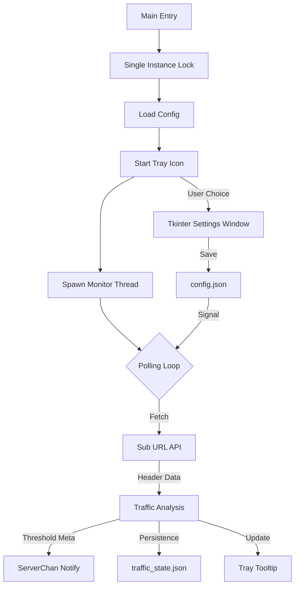

# Architecture Overview

**Analysis Date:** 2026-04-11

## System Design

Proxy Monitor is a single-process Windows service application with a GUI management layer. It follows a multi-threaded polling architecture.

## Core Components

### 1. Main Application (`proxy_monitor.pyw`)
The application entry point. It manages:
- **Single Instance Lock:** Binds to a local TCP port (54321) to prevent multiple concurrent processes.
- **Log Redirection:** Redirects `sys.stdout` and `sys.stderr` to `monitor.log` immediately upon startup.

### 2. Background Monitor (`monitor_loop`)
A dedicated daemon thread that:
- Periodically polls the subscription URL.
- Calculates traffic deltas (current usage vs. stored state).
- Triggers notifications via ServerChan.
- Updates the System Tray icon tooltip with live data.

### 3. UI Layer (Tkinter)
The settings window (`open_settings`):
- Runs in a separate thread to keep the tray icon responsive.
- Provides form-based editing for `config.json`.
- Implements visual effects (fade-in, centering).
- Uses a modern dark-themed custom styling (`Indigo 500` palette).

### 4. Tray Interaction (Pystray)
The primary user interaction point:
- Persists in the Windows notification area.
- Displays current traffic status on hover.
- Context menu for: Force refresh, Settings, and Exit.

## Data Flow

## Patterns & Abstractions

- **Polling:** The system relies on a periodic loop rather than real-time hooks (due to the nature of HTTP subscription info).
- **Concurrency:** Uses `threading.Thread` and `threading.Event` for synchronization between UI and Background tasks.
- **Persistence:** Direct JSON serialization/deserialization for state and configuration.

---

*Architectural analysis: 2026-04-11*
