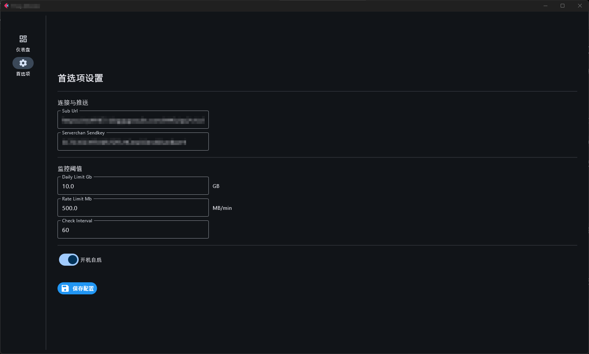

# 🚀 Proxy Traffic Monitor | 代理流量监控小助手

一款专为 Windows 用户设计的轻量级代理订阅流量监控工具。它驻留在系统托盘，实时显示流量消耗，并在流量超限或异常波动时通过 Server酱 向您发送提醒。

---

## ✨ 功能特性

- **📂 实时监控**：自动获取订阅链接中的 `Subscription-Userinfo` 标头，实时统计上传、下载及剩余流量。
- **🎨 托盘交互**：简洁的系统托盘图标，悬停即可查看当前速率、今日已用和剩余流量。
- **⚙️ 图形化配置**：内置 Tkinter 编写的设置窗口，无需修改代码即可定义所有参数。
- **🚨 智能预警**：
  - **每日限额**：达到设定的每日流量阈值时触发警报。
  - **速率异常**：检测到单位时间内流量突发消耗（如后台大文件下载等）时触发警报。
- **🔔 消息推送**：支持通过 **Server酱 (Turbo)** 将预警信息推送到您的微信/手机。
- **🔄 开机自启**：一键开启 Windows 注册表自启动，后台无感运行。

## 📸 预览展示




## 🛠️ 安装与运行

### 1. 环境要求
- Windows 10/11
- Python 3.7+

### 2. 获取程序

您可以选择以下两种方式之一：

#### A. 开发者方式 (通过 Git 克隆)
```bash
git clone https://github.com/DaphnisNerii/Proxy_Monitor.git
cd Proxy_Monitor
```

#### B. 普通用户方式 (下载压缩包)
前往 [Releases](https://github.com/DaphnisNerii/Proxy_Monitor/releases) 页面，下载最新的 `Source code (zip)` 文件并解压到本地文件夹。

### 3. 安装依赖
程序会在首次启动时自动尝试安装必要的依赖。若自动安装失败，请在项目根目录手动执行：
```bash
pip install pystray pillow
```

### 4. 启动程序
由于本程序是后台托盘工具，推荐使用 `pythonw` 运行以隐藏控制台窗口：
- 直接双击 `proxy_monitor.pyw`
- 或在命令行执行：
  ```bash
  pythonw proxy_monitor.pyw
  ```

## ⚙️ 配置说明

首次运行时，程序会自动加载默认配置并生成 `config.json`。您可以右键托盘图标点击 **设置** 进行修改：

- **订阅链接 (sub_url)**: 您的代理服务提供商给出的订阅地址。
- **Server酱 Key**: 从 [Server酱官网](https://sct.ftqq.com/) 获取的 SendKey。
- **流量阈值**: 
    - 每日限额 (GB)：当天累计消耗超过此值时预警。
    - 速率阈值 (MB/m)：每分钟消耗超过此值时预警。
- **检查间隔**: 建议设为 60 秒。

> [!IMPORTANT]
> **隐私提醒**: 请**务必不要**将您的 `config.json` 上传到任何公开仓库。本项目已预设了 `.gitignore` 来保护您的个人隐私。

## 📂 项目结构

```text
Proxy_Monitor/
├── proxy_monitor.pyw     # 主程序 (无窗口运行)
├── config.json           # 个人配置文件 (已被忽略，不提交)
├── config.json.example   # 配置模板
├── .gitignore            # Git 忽略规则
└── README.md             # 项目说明文档
```

## 🤝 贡献与反馈

如果您在使用过程中发现 Bug 或有新的功能建议，欢迎提交 Issue 或 Pull Request！

---

**如果这个小工具对您有帮助，点个 Star ⭐️ 就是对作者最大的支持！**
